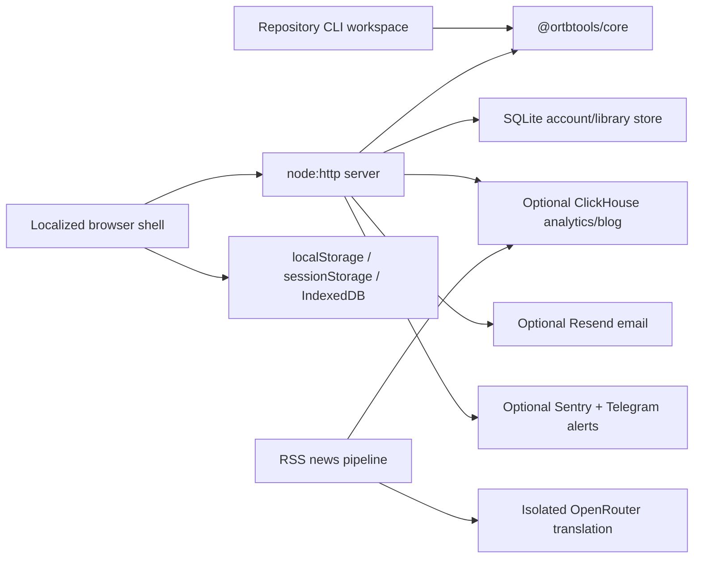

# Platform Architecture: Current Implementation

**Observed**: 2026-08-11
**Applies to**: App `1.14.5`, Core `0.35.0`, CLI `0.1.1`

This is the as-built component map. It explains ownership and dependency direction; durable reasons
for architectural choices belong in indexed ADRs.

## Runtime Shape

Core is below every validation consumer. Browser modules never bypass the HTTP boundary to claim
hosted validation is local. Persistence adapters are optional where documented and never become a
dependency of Core's main validation APIs.

## Component Ownership

| Concern                                                               | Owner                                                               | Direct consumers                           |
| --------------------------------------------------------------------- | ------------------------------------------------------------------- | ------------------------------------------ |
| HTTP composition, shared limits, static serving, dependency injection | `server.js`                                                         | Process entry point                        |
| Backend route matching                                                | `lib/router.js`                                                     | `server.js`, handler modules               |
| JSON/error helpers and body cap                                       | `lib/http.js`                                                       | Backend handlers                           |
| Feature APIs                                                          | `modules/*/handler.js`, `modules/admin/blog.js`                     | Browser and HTTP clients                   |
| Accounts, sessions, partners, samples, activity, corpus, dialects     | `db.js`, `auth.js`                                                  | Authenticated handlers                     |
| Validation, detection, crosscheck, mirror                             | `packages/core/`                                                    | Analyze/mirror/replay handlers, CLI, tests |
| Terminal interface and exit semantics                                 | `packages/cli/`                                                     | Local operators and CI callers             |
| SPA route activation and persistent chrome                            | `public/shell-boot.js`, `public/core/`                              | Localized shells                           |
| Route-level and action UI                                             | `public/modules/`                                                   | SPA registry and inspector dispatcher      |
| Inspector workbench compatibility layer                               | `public/ortbtools.app.js`                                           | Inspector route module                     |
| Browser encryption/session lifecycle                                  | `public/ortbtools-crypto.js`, `public/core/session.js`              | Auth and sample modules                    |
| Locale-aware server routes                                            | `lib/locale-routes.js`                                              | Static server                              |
| Route metadata, SSR, and sitemap rendering                            | `lib/seo.js`, `lib/landings.js`                                     | Static server                              |
| Hybrid blog reads and publication                                     | `lib/blog-service.js`, blog handlers                                | Browser, sitemap, RSS, admin               |
| Derived analytics                                                     | `lib/validation-log.js`, `lib/event-log.js`                         | Analyze/stream and request lifecycle       |
| Structured logging and optional server-side error capture             | `lib/logger.js`                                                     | Server composition and backend handlers    |
| Immutable release state machine                                       | `scripts/deploy.sh`, `scripts/deploy-lib.sh`, `scripts/rollback.sh` | Authorized production operator             |

## Backend Composition

`server.js` creates shared services, registers `{ id, routes }` modules in order, then starts one
HTTP server. A route is exact, has a single-segment `:param`, or uses a trailing `*` prefix. First
match wins. Handlers receive the native request/response objects, one parsed URL, and match metadata.
An unmatched `/api/*` request receives a JSON 404; other misses use static-file handling.

Handler factories accept their dependencies from the composition root. This keeps rate limiters,
authentication, persistence, and Core calls visible at registration rather than hidden as secondary
routers. The implemented route families and access boundaries are captured in
[the HTTP contract](./contracts/http-api.md).

`lib/logger.js` owns one process-wide Pino logger and the optional Sentry-compatible SDK wrapper.
The wrapper is locally configured only when the SDK client retains a parsed destination. The health
projection exposes that boolean without destination detail; it is not a network, ingestion, or
delivery probe. Telegram is an independent alert path. Neither optional reporter is a dependency of
Core validation or application liveness.

The static path:

1. resolves locale and canonical redirects;
2. confines filesystem access to `public/`;
3. injects content hashes into served HTML and JavaScript references;
4. rewrites route-specific SEO and may inject SSR blog/landing content;
5. applies security, cache, compression, and robot headers; and
6. serves a real 404 for unknown routes rather than a universal SPA fallback.

## Core and CLI

`packages/core/index.js` is the Core public entry point. Detection selects payload type, OpenRTB
version, and format; version-specific baseline validators and registered rule plugins emit neutral
findings; finalization filters, deduplicates, sorts, adds spec references, and resolves localized
messages. Crosscheck and mirror use the same finding and localization boundary.

Core is CommonJS and supports Node.js `>=18`; the root application requires Node.js `>=22.13.0`.
The CLI reads files or stdin, delegates to Core, and owns human/JSON output plus the stable exit-code
contract. The root npm workspace links both packages locally. Publication is a separate manual
workflow described in [docs/NPM_PUBLISH.md](../../docs/NPM_PUBLISH.md).

## Frontend Composition

Each locale has a static shell. `public/shell-boot.js` installs the session service and modal host,
mounts persistent navigation/topbar chrome, registers lazy sections, and maps History API navigation
to the registry. `public/core/registry.js` loads a section once and creates a fresh lifecycle context
on every activation.

The route-level section set is Inspector, Library, Docs, Dialects, Live, Blog, Behavior, Insights,
and token-gated Blog Admin. A lightweight landing module preserves server-rendered landing content.
Action modules such as auth, save/edit sample, partner, mirror, simulate, unlock, recovery, share,
and search are loaded by their owning shell or feature rather than registered as routes.

The complete lifecycle and compatibility rules are in
[the frontend modules contract](./contracts/frontend-modules.md).

## Storage Topology

- SQLite schema v10 is opened in WAL mode with foreign keys and atomic `PRAGMA user_version`
  migrations. It owns account-scoped and operational state.
- The stream module creates a separate bounded `cached_specimens` table for synthetic permalink
  envelopes when it receives the SQLite dependency.
- ClickHouse is optional. With credentials and no analytics kill switch, it accepts derived
  validation rows and sampled operational events; it also backs the news/blog workflow.
- Browser `localStorage` holds raw recent Inspector history and preferences; `sessionStorage` holds
  per-tab continuity state; IndexedDB holds derived discovery observations and temporary dialects.

Entity-level truth and deletion relationships are in [data-model.md](./data-model.md), while
processing and retention guarantees are in [the data-retention contract](./contracts/data-retention.md).

## Content, Locales, and Versions

English is the canonical unprefixed route family. Ukrainian and Russian paths prefix the same route
contract. The server serves a locale-specific shell, while Core finding messages and web/module copy
come from separate registries that must move together.

SEO metadata is computed per requested route even when several routes share one shell. Editorial
Markdown is the only post source eligible for indexing after an explicit quality gate; ClickHouse
news posts remain readable but noindex. See [content and SEO](./contracts/content-seo.md) and
[locales and versioning](./contracts/locales-versioning.md).

## Build and Release Boundary

The Dockerfile installs production dependencies in a builder stage and copies the repository into a
non-root Node runtime after `.dockerignore` removes governance, tests, documentation, secrets, and
host-only tooling. Application source, workspaces, static assets, samples, and the editorial seed are
baked into the image. The compose service provides only `/data` as a runtime mount.

Production deployment accepts only a clean `main` equal to `origin/main`, tags the image with exact
Git provenance, starts it without an automatic restart policy, waits for readiness, runs public
smoke checks, and only then commits the tag and `restart: always`. A failed candidate attempts the
same verified transition to a recorded rollback image. See
[the release/deploy contract](./contracts/release-deploy.md) and the operator-owned
[runbook](../../docs/OPERATIONS.md).

## Verification Topology

The root quality gate is Prettier check, ESLint, JSDoc/TypeScript checking, and the Node test suite
with coverage. GitHub CI additionally runs npm package-manifest smoke and a throwaway production
Docker build/run smoke. Shell simulations exercise deploy, rollback, recovery, backup, and cutover
logic without mutating production.

Use [quickstart.md](./quickstart.md) to validate this architecture by surface. Test output, not a
documented total, is the authority for the current test count.
